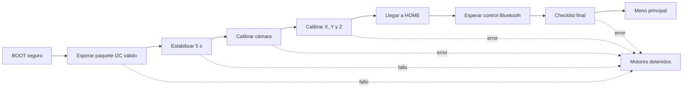

# Informe de integración del brazo cartesiano

## 1. Resultado

Se crearon dos firmwares nuevos, coordinados y compilables:

- `ESP/ESP.ino`: firmware integrado para ESP32, Bluepad32, servos, OLED,
  I2C esclavo y HUSKYLENS 2 por UART.
- `PORTENTA/PORTENTA.ino`: firmware coordinador para Portenta H7 con Machine
  Control, motores, finales, calibración, HOME, checklist, menú y automático XY.

También se creó `tests/protocol_layout_test.cpp` como tercer programa auxiliar de
verificación del protocolo. Los tres sketches funcionales originales permanecen
sin modificaciones y sirven como referencia.

La integración no implementa agarre, descenso automático de Z ni retorno
automático después de una detección.

## 2. Conexiones

### HUSKYLENS 2 a ESP32 UWB

La cámara se mantiene por UART2 a 115200 baudios.

| HUSKYLENS 2 | ESP32 UWB | Función |
|---|---|---|
| TX | GPIO32 | RX2 de la ESP32 |
| RX | GPIO33 | TX2 de la ESP32 |
| GND | GND | Referencia eléctrica común |
| Alimentación | Fuente adecuada al módulo | Seguir tensión y corriente especificadas por el fabricante |

RX y TX se conectan cruzados: el TX de un equipo siempre llega al RX del otro.
No se debe conectar la HUSKYLENS al bus I2C de control ni al bus de la OLED.

### Pines conservados en la ESP32

| Subsistema | Pin o bus |
|---|---|
| I2C esclavo hacia Portenta, SDA | GPIO27 |
| I2C esclavo hacia Portenta, SCL | GPIO14 |
| Dirección I2C ESP32 | `0x40` |
| OLED SH1106, SDA | GPIO21 |
| OLED SH1106, SCL | GPIO22 |
| Dirección OLED | `0x3C` |
| Servo de rotación | GPIO25 |
| Servo de pinza | GPIO26 |
| HUSKYLENS UART2, RX | GPIO32 |
| HUSKYLENS UART2, TX | GPIO33 |

Los dos buses I2C físicos siguen separados. La Portenta es la única maestra del
bus de control y la ESP32 es su esclava. Simultáneamente, la ESP32 es maestra de
su segundo bus para la OLED. Esta es la arquitectura de dos controladores/buses
que ya evitaba que la pantalla retrasara el control de motores.

### Canales conservados en Machine Control

| Eje | STEP/PUL | DIR | Final negativo | Final positivo |
|---|---:|---:|---|---|
| X | DO4 | DO5 | DIN00 | DIN01 |
| Y | DO2 | DO3 | DIN02 | DIN03 |
| Z | DO0 | DO1 | DIN05, abajo | DIN04, arriba |

La lógica NC activa-baja no cambió: una lectura activa representa final pulsado
o circuito abierto. Tampoco cambiaron los sentidos: DIR HIGH incrementa el
contador y DIR LOW lo decrementa.

## 3. Arquitectura de ejecución

### ESP32

El `loop()` principal mantiene siempre estas tareas:

- actualización Bluepad32;
- lectura del control y actualización de servos;
- consumo de paquetes I2C ya recibidos;
- preparación periódica de una instantánea I2C con CRC;
- recuperación y actualización de la OLED;
- diagnóstico por Serial.

Las llamadas a `DFRobot_HuskylensV2` se ejecutan exclusivamente en una tarea
FreeRTOS de prioridad `tskIDLE_PRIORITY`. La versión local 1.0.9 de esa librería
puede esperar activamente hasta 5 segundos por una respuesta. Además se redujo
`huskylens.retry` de 5 a 1. Por tanto, una cámara desconectada puede retrasar la
tarea de visión, pero no congela Bluepad32, servos, OLED, I2C ni el `loop()`.

Los callbacks I2C son deliberadamente cortos:

- `requestEvent()` copia una instantánea preconstruida y ejecuta `Wire.write()`;
- `receiveEvent()` solo drena bytes y guarda una estructura pendiente;
- CRC, validación, cámara, Serial y OLED se procesan fuera de los callbacks.

### Portenta

La Portenta mantiene la autoridad sobre cualquier movimiento. El ticker de
100 microsegundos conserva la generación de pulsos original; el programa
principal lee finales, valida I2C, procesa la máquina general y aplica bloqueos
de seguridad.

La calibración del brazo ya no se ejecuta desde el manejador del control. Se
procesa directamente desde `loop()`, por lo que continúa aunque Bluetooth no
esté conectado.

## 4. Secuencia automática de arranque



1. Las salidas STEP quedan en LOW antes de habilitar el ticker.
2. Se concede a la ESP32 un margen inicial de 3 s antes del sondeo.
3. La Portenta no considera establecido el enlace por un ACK de dirección. Exige
   un paquete de 28 bytes con magic, versión, longitud, semántica y CRC válidos.
4. La espera de 5 s comienza exactamente al entrar ese primer paquete válido.
5. La Portenta emite `CAM_CMD_CALIBRAR` con una secuencia y lo retransmite hasta
   observar el acuse correspondiente.
6. La ESP32 conecta la cámara, abre tags, calcula la homografía y abre el modelo.
7. Al recibir cámara conectada, homografía válida y modelo listo, la Portenta
   inicia automáticamente la calibración X/Y/Z.
8. El brazo realiza HOME al centro y define X=Y=Z=0.
9. Solo entonces espera el control y ejecuta el checklist final.

Una pérdida de enlace durante la espera de 5 s reinicia esa espera. Una pérdida
posterior detiene motores y entra al estado seguro de error.

### Recuperación automática del arranque I2C

La ESP32 ya no ejecuta un único `Wire.begin()` durante `setup()`. El primer
intento como esclava `0x40` se realiza 1.5 s después del arranque y, si SDA/SCL
todavía no están en reposo o el driver rechaza el inicio, se repite cada 500 ms
sin detener Bluetooth, cámara, servos ni OLED. Cada intento informa por Serial
su número, los niveles observados en SDA/SCL y el resultado del driver; la OLED
distingue `I2C INICIANDO`, `I2C REINTENTANDO` e `I2C LISTO`.

Si transcurren 15 s sin recibir ningún paquete válido de la Portenta, la ESP32
ejecuta un único `ESP.restart()`. Un contador con firma en la sección RTC
`noinit` impide un ciclo infinito: después de ese reinicio siguen los reintentos
de `Wire`, pero no se vuelve a reiniciar automáticamente. El contador se borra
al recibir el primer paquete válido o en el siguiente encendido físico. Esta
recuperación solo actúa durante el arranque; una pérdida posterior conserva la
parada segura y el manejo de errores existente.

La Portenta mantiene su retención inicial de 3 s. Antes de recibir el primer
paquete válido sondea a la ESP32 cada 100 ms, dejando ventanas libres para los
reintentos del esclavo. Después del primer paquete válido recupera el periodo
normal de control de 5 ms. Los estados Portenta->ESP continúan enviándose cada
100 ms en ambas fases.

## 5. Máquina de cámara

Estados publicados:

| Estado | Acción |
|---|---|
| `CAMARA_OFFLINE` | Espera el próximo intento de conexión |
| `CAMARA_CONECTANDO` | Ejecuta un único intento UART aislado |
| `CAMARA_STANDBY` | Cámara conectada, esperando orden |
| `CAMARA_ABRIENDO_TAGS` | Abre Tag Recognition y espera 3 s sin bloquear `loop()` |
| `CAMARA_CALIBRANDO` | Reúne muestras de los cuatro tags |
| `CAMARA_CALCULANDO` | Resuelve y publica la homografía |
| `CAMARA_ABRIENDO_MODELO` | Abre el modelo personalizado y espera 8 s |
| `CAMARA_LISTA` | Mantiene el modelo y procesa piezas |
| `CAMARA_ERROR` | Publica causa y espera reset o recuperación permitida |

La cámara se reconecta cada 2 s cuando está ausente. Los errores de comunicación
recuperables regresan a `OFFLINE`; los errores matemáticos o de calibración
requieren una orden nueva/reintento seguro.

Si se pierde la Portenta, la ESP32 borra objetivos y el dominio anterior de
secuencias de comando. Esto permite reiniciar solo la Portenta sin que un comando
de calibración nuevo sea confundido con una retransmisión antigua.

## 6. Algoritmo de calibración de visión

Se conservaron los parámetros y la matemática del programa funcional:

- tags esperados: 0, 1, 2 y 3;
- 25 muestras por tag;
- banda blanca: 292 mm;
- ancho total: 412 mm;
- aluminio por lado: 60 mm;
- centros laterales de tags: X = aproximadamente ±176 mm;
- distancia entre filas: 382 mm;
- modelo personalizado: índice 1, `ALGORITHM_CUSTOM_BEGIN + 1`;
- X de cámara positivo hacia la derecha;
- Y de cámara positivo hacia abajo;
- origen en el centro geométrico de los cuatro tags.

Las correspondencias físicas son:

| Tag | X (mm) | Y (mm) |
|---:|---:|---:|
| 0, superior izquierdo | -176 | -191 |
| 1, superior derecho | +176 | -191 |
| 2, inferior derecho | +176 | +191 |
| 3, inferior izquierdo | -176 | +191 |

Después de promediar los centros de imagen, se construyen ocho ecuaciones para
los ocho parámetros libres de una homografía 3x3. El sistema 8x8 se resuelve con
Gauss-Jordan y pivoteo parcial. La conversión es:

```text
X = (h00*u + h01*v + h02) / (h20*u + h21*v + 1)
Y = (h10*u + h11*v + h12) / (h20*u + h21*v + 1)
```

Se rechazan pivotes/denominadores degenerados y resultados no finitos. Una pieza
solo es válida dentro de X=[-176,+176], Y=[-191,+191] y, adicionalmente, sobre
la banda blanca X=[-146,+146] mm.

## 7. Filtro de piezas y prevención de duplicados

Una lectura aislada nunca genera movimiento.

- Se requieren 4 detecciones consecutivas de la misma clase.
- La dispersión total mínimo-máximo de las cuatro lecturas debe ser como máximo
  4 mm en X y 4 mm en Y; una deriva gradual no puede superar la tolerancia.
- Si hay varias piezas, se continúa con la que coincide con el candidato actual;
  de otro modo se inicia con la primera pieza válida de la lectura.
- X/Y se publican como `int16_t` en décimas de milímetro.
- La secuencia del objetivo se incrementa saltando el valor cero.
- El objetivo queda latched e inmutable hasta el acuse de Portenta.
- No se crea otro objetivo cuando el brazo está ocupado.
- Después del acuse, la ausencia no empieza a contarse mientras el brazo siga
  ocupado. Al terminar el movimiento se exige 1 s sin la pieza procesada antes
  de rearmar; otras piezas válidas pueden permanecer en escena. La asociación
  de la pieza procesada usa clase y una ventana configurable de 8 mm.
- Salir del automático, perder I2C o reiniciar una sesión invalida objetivos
  antiguos.

## 8. Protocolo I2C versión 2

Las copias `ESP/ProtocoloI2C.h` y `PORTENTA/ProtocoloI2C.h` son idénticas. Todos
los campos son enteros de tamaño fijo, estructuras `packed` y little-endian. No
se envían `float`, `bool`, enums ni punteros.

El checksum es CRC-8/ATM, polinomio `0x07`, inicio `0x00`, sobre todos los bytes
excepto el último campo de CRC.

### ESP32 a Portenta: 28 bytes

| Grupo | Contenido |
|---|---|
| Cabecera | magic `0xE3`, versión 2, longitud 28, secuencia de paquete |
| Sesión | identificador aleatorio de arranque ESP32 |
| Control | flags, joystick X/Y/Z, botones y dos ángulos de servo |
| Cámara | estado, error, acuse de comando y muestras de cuatro tags |
| Objetivo | clase, X10, Y10, secuencia |
| Integridad | CRC-8/ATM |

La secuencia de paquete debe avanzar. Aunque el callback siga respondiendo, una
instantánea congelada durante 150 ms se considera pérdida del enlace.

### Portenta a ESP32: 32 bytes exactos

| Grupo | Contenido |
|---|---|
| Cabecera | magic `0xA7`, versión 2, longitud 32 |
| Sistema | estado, opción, fase de brazo, flags, límites y movimientos compactados |
| Órdenes | error, comando de cámara y secuencia del comando |
| Objetivo | secuencia confirmada y código de aceptación/rechazo/cancelación |
| OLED | cuatro valores `int32_t` con semántica dependiente del estado |
| Integridad | CRC-8/ATM |

El paquete de 32 bytes no tiene espacio para campos adicionales. Cualquier
ampliación futura exige una versión nueva o fragmentación explícita.

## 9. Calibración y movimiento del brazo

La secuencia mecánica original se conserva:

1. búsqueda rápida del extremo negativo;
2. liberación del final;
3. separación de 300 pasos;
4. segundo toque lento;
5. contador temporal cero;
6. repetición equivalente en el extremo positivo;
7. medición del rango;
8. repetición para X, Y y Z;
9. movimiento simultáneo al centro de los tres recorridos;
10. comprobación de que los tres centros se alcanzaron;
11. definición del centro como X=Y=Z=0.

Cada fase tiene timeout de 180 s. Se mantienen los divisores de velocidad 1/2/8
y los recorridos de referencia X=496 mm, Y=337 mm. La escala sigue siendo:

```text
pasosPorMmX = rangoXPasos / 496
pasosPorMmY = rangoYPasos / 337
```

La cinemática inversa cartesiana existente se conserva: multiplica X/Y por sus
pasos por milímetro y comprueba límites con margen de seguridad de 2 mm. Z se
recibe para compatibilidad, pero no se convierte ni se mueve en posicionamiento.

## 10. Menú y modos

El menú lógico contiene exactamente cuatro opciones:

1. Modo manual.
2. Modo automático.
3. Calibración de brazo.
4. Calibración de cámara.

### Manual

Conserva joystick X/Y, joystick derecho para Z, límites direccionales, ambos
servos y retorno con triángulo. Una desconexión Bluetooth neutraliza y detiene.

### Automático

Requiere cámara lista y brazo calibrado. Para cada objetivo estable:

1. convierte X/Y x10 a milímetros;
2. transforma cámara a brazo;
3. ejecuta la cinemática y validación de límites;
4. confirma o rechaza la secuencia;
5. mueve solo X/Y;
6. se detiene al alcanzar el objetivo.

No mueve Z, no acciona pinza, no regresa a HOME y no inicia otra pieza mientras
el brazo está ocupado. Triángulo cancela y regresa al menú.

### Recalibraciones

La opción 3 repite X/Y/Z y HOME sin depender del control durante el movimiento.
La opción 4 invalida la calibración de cámara anterior, vuelve a capturar tags,
recalcula la homografía y reabre el modelo.

Desde el estado de error, el botón X y el comando `REINTENTAR` distinguen el
subsistema que falló. Los errores de cámara, timeout de cámara y fallos de
checklist asociados a cámara, homografía o modelo reinician únicamente la
calibración de cámara cuando X/Y/Z siguen válidos; se conservan rangos, escalas,
posición y HOME del brazo. Si el error ocurrió durante el arranque antes de que
el brazo llegara a calibrarse, al terminar la cámara se continúa con la primera
calibración pendiente del brazo. Los errores no relacionados con cámara
conservan el reinicio completo de seguridad.

## 11. Transformación cámara a brazo

Los parámetros están concentrados al inicio de `PORTENTA.ino`:

```cpp
constexpr bool CAMERA_SWAP_XY = false;
constexpr int8_t CAMERA_SIGN_X = 1;
constexpr int8_t CAMERA_SIGN_Y = 1;
constexpr float CAMERA_OFFSET_X_MM = 0.0f;
constexpr float CAMERA_OFFSET_Y_MM = 0.0f;
```

Primero se intercambian ejes si corresponde, luego se aplica el signo y al final
el offset. Estos cinco valores deben ajustarse con una medición física entre el
origen de los tags y HOME. Ningún ajuste requiere modificar la homografía.

## 12. Checklist y seguridad

El checklist exige:

- I2C vigente;
- protocolo y base ESP32 válidos;
- cámara UART conectada y sin error;
- homografía válida;
- modelo listo;
- calibraciones XY y Z válidas;
- brazo detenido exactamente en HOME;
- control Bluetooth conectado;
- ausencia de error de calibración;
- ningún final activo y ningún par de finales incoherente.

Medidas adicionales:

- timeout I2C de 150 ms;
- timeout de avance de la secuencia ESP32 de 150 ms;
- diez paquetes inválidos consecutivos generan error crítico;
- reiniciar la ESP32 cambia su sesión, detiene movimiento y descarta objetivos;
- timeout de cámara de 240 s;
- timeout de movimiento posicionado de 180 s;
- un final encontrado durante movimiento posicionado cancela e invalida XY;
- dos finales opuestos activos simultáneamente generan error inmediato;
- `STOP` detiene los tres ejes;
- cualquier error general fuerza STEP en LOW y permite reintento con X cuando el
  control está disponible o con `REINTENTAR` por terminal; si el enlace sigue
  caído, el sistema permanece esperando sin mover.

Los finales son NC y el hardware no permite distinguir por software entre un
final realmente pulsado y un cable abierto. Tampoco existen encoders: la posición
es una estimación por pulsos ordenados. Estas limitaciones deben considerarse en
la evaluación de riesgo de la máquina.

## 13. Terminal conservada

Se mantienen a 115200 baudios:

- `GOTO X Y Z`;
- `X Y Z` como forma abreviada;
- `HOME`;
- `POS`;
- `RANGO`;
- `STOP`;
- `REINTENTAR` desde el estado de error;
- `AYUDA`.

`GOTO` y `HOME` se permiten desde el menú cuando existe enlace y XY está
calibrado. Ambos usan la misma validación que automático y siguen sin mover Z.

## 14. Verificación realizada

Entorno local utilizado:

- Arduino CLI 1.4.1;
- core `esp32-bluepad32:esp32` 4.1.0;
- core `arduino:mbed_portenta` 4.5.0;
- DFRobot_HuskylensV2 1.0.9;
- Arduino_MachineControl 1.1.2;
- ESP32Servo 3.1.3;
- Adafruit GFX 1.12.5 y SH110X 2.1.14.

Compilaciones:

| Programa | FQBN | Resultado |
|---|---|---|
| Original ESP_SLAVE | `esp32-bluepad32:esp32:esp32` | Correcto, línea base |
| Original MAster | `arduino:mbed_portenta:envie_m7` | Correcto, línea base |
| Nuevo ESP | `esp32-bluepad32:esp32:esp32` | Correcto |
| Nuevo PORTENTA | `arduino:mbed_portenta:envie_m7` | Correcto |

Además:

- ambos headers tienen el mismo contenido;
- `static_assert` exige 28 y 32 bytes y confirma que el CRC es el último byte;
- se verificó el vector canónico CRC-8/ATM `"123456789" -> 0xF4`;
- la recuperación de arranque I2C compila sin advertencias propias en ambos
  sketches; el modo estricto solo reporta advertencias preexistentes de
  `ESP32Servo`, `DFRobot_HuskylensV2`, `Arduino_MachineControl` y la sobrecarga
  antigua de `Ticker.attach(float)`;
- no existen esperas largas `delay()` durante la operación normal de la ESP32;
  se conserva `delay(1)` para ceder CPU y solo se usan 50 ms inmediatamente
  antes del reinicio excepcional de recuperación I2C;
- los originales no fueron sobrescritos.

## 15. Pruebas físicas pendientes

La compilación no sustituye la puesta en marcha física. Antes de habilitar
movimientos a velocidad normal se debe verificar:

1. tierra común y alimentación correcta de HUSKYLENS;
2. TX/RX UART cruzados y nivel lógico adecuado;
3. polaridad NC y correspondencia real de los seis finales;
4. sentido positivo de cada eje con movimientos cortos;
5. funcionamiento de una parada de emergencia física independiente del software;
6. tags 0-1-2-3 en el orden y medidas documentadas;
7. valor real de `CAMERA_SWAP_XY`, signos y offsets;
8. repetibilidad de HOME y ausencia de pérdida de pasos;
9. desconexión deliberada de cámara, ESP32, control y OLED;
10. rechazo de objetivos en bordes y fuera de rango;
11. no repetición de una pieza que permanezca bajo la cámara;
12. cancelación con triángulo y `STOP` durante movimiento.
13. diez encendidos simultáneos Portenta-ESP32 sin pulsar RESET;
14. encendido en ambos órdenes y ESP32 sin Portenta, comprobando que exista como
    máximo un reinicio automático y luego reintentos indefinidos.

Hasta completar estas pruebas, el sistema debe ensayarse con drivers limitados,
zona despejada y posibilidad de cortar energía inmediatamente.
